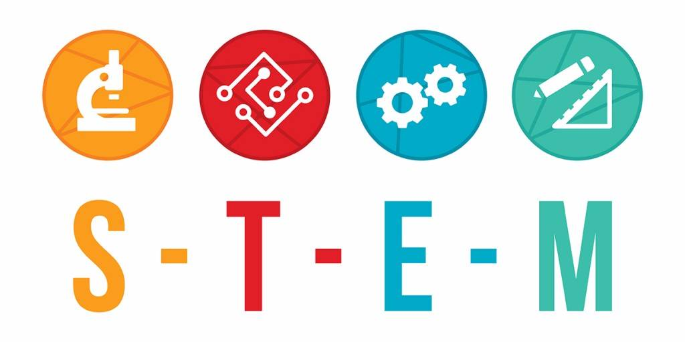

# STEM 직군 연봉 예측 머신러닝 프로젝트  

* STEM: Science, Tech, Engineering, Math의 앞글자를 딴 말로 이공계를 의미합니다.
* 한국 IT 기업이 기업 문화나 여러 측면에서 영향을 많이 받는 실리콘 밸리 기업의 개발자나 STEM 직군 종사자들의 연봉을 분석함으로써 최근 한국 내 STEM 직군 종사자들의 연봉이 오르는 현상, 또 거기에 영향을 미치는 요인이 무엇인지 등에 대해서도 통찰을 얻을 수 있을 것이라 생각합니다. 
* 또한, IT 업계에서는 이직이 잦은데 이직 조건 중 연봉이 차지하는 비중은 큽니다. 이에 대해 검색을 해보는 경우가 많은데, 실제 연봉 데이터를 기반으로 API 서비스를 개발하여 회사 이름과 직책, 직군 등 조건을 입력하면 연봉을 예측해주는 앱을 만든다면, 많은 사람들이 이용할 것이라 생각합니다.

## 이전까지 진행 상황(2022/01에 수행)
* 캐글 데이터를 이용, colab에 업로드하여 진행
* 시각화
* 전처리, 특성공학
* 머신러닝 알고리즘 적용
  * 선형 회귀
  * 릿지 회귀
  * xg부스트
  * 랜덤포레스트
* 결과 시각화

## 수정/보완 방향(2022/05)
* [ ] 데이터 파이프라인 구축
* [x] README 추가
* [ ] 데이터를 requests 이용 가져오기
* [ ] 데이터를 DB에 저장
* [ ] 대시보드 이용 데이터 시각화 추가
* [ ] 리팩터링
* [ ] 주석 적절히 달고 수정
* [ ] Heroku 이용 배포
* [ ] Flask 이용 웹 앱 개발
